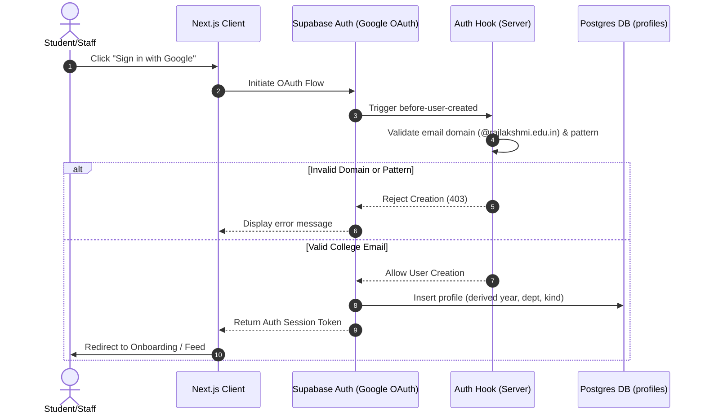
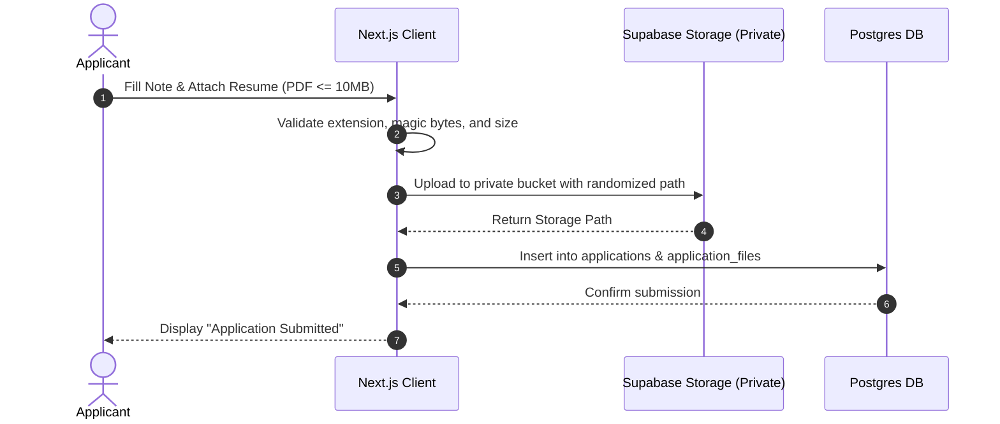
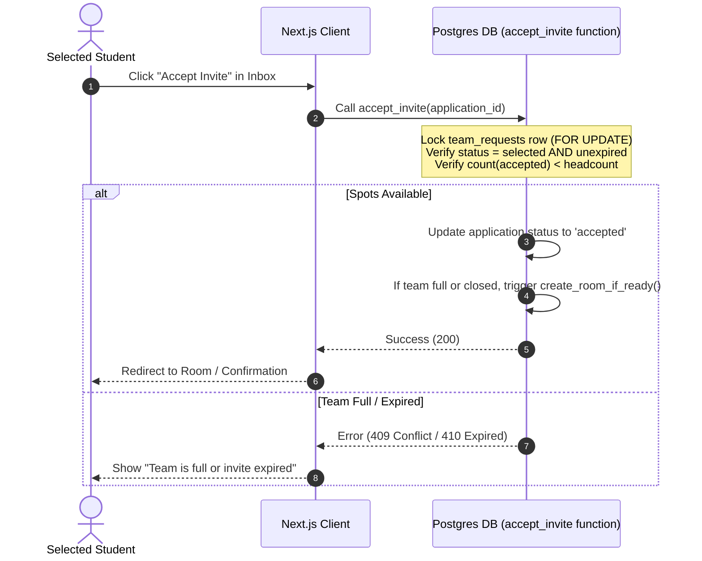
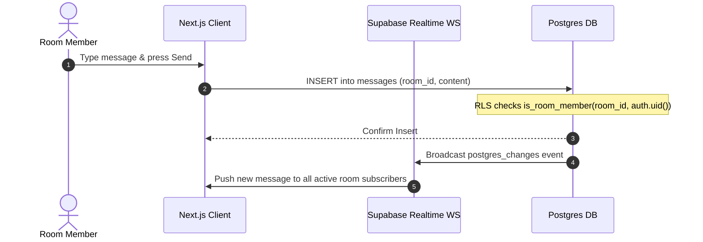
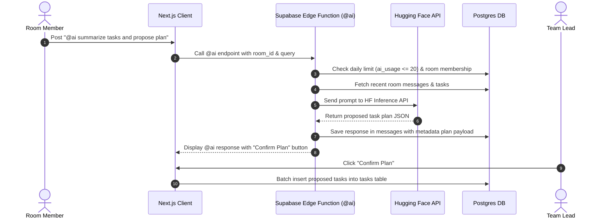
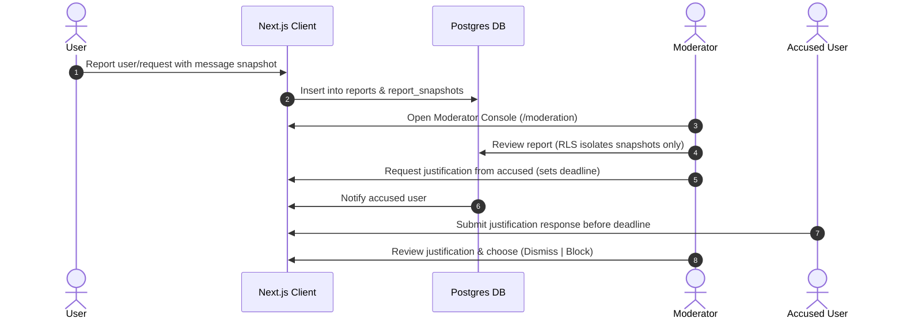

# Architecture & System Design

**Status:** Draft for Owner Approval  
**Date:** October 6, 2026  
**Target College:** Rajalakshmi Engineering College (`rajlakshmi.edu.in`)

---

## 1. Modules and Boundaries

The application is structured into decoupled domain modules. Each module corresponds to specific features defined in `docs/spec.md` (F1 to F16).

| Module | Spec Feature | Responsibilities & Boundaries |
|---|---|---|
| **Auth & Profile** | F1, F15 | Server-side domain validation, email parsing, onboarding, profile management, and account deactivation. |
| **Requests & Feed** | F2 | Posting team requests, skill tags, filter enforcement (year, department, gender), lead console. |
| **Applications & Storage** | F3, F8 | Application submission, file uploads, file validation, applicant withdrawal, document deletion. |
| **Invites & Selection** | F4 | Lead applicant selection, atomic invite acceptance, waitlisting, headcount tracking. |
| **Room Lifecycle** | F5, F7 | Team room creation, follow-up request room linkage, lead transfer, member removal with reason. |
| **Inbox & Notifications** | F6, F11 | Notification creation, inbox UI, transactional emails via Resend, Web Push via VAPID. |
| **Room Chat & Files** | F8 | Realtime WebSocket chat, message attachments, replies, emoji reactions, @mentions. |
| **Task Management** | F9, F10 | Kanban board, single-level subtasks, assignees, deadlines, milestones, meeting scheduler. |
| **Progress Dashboard** | F11 | Room-level and member-level task progress aggregation for leads and mentors. |
| **Staff Mentorship** | F12 | Staff mentor invitations, mentor acceptance, staff console, non-member mentor access. |
| **@ai Assistant** | F13 | Hugging Face inference integration, room context gathering, daily limit tracking, plan generation. |
| **Moderation & Safety** | F14 | User/request reporting, message snapshot attachments, justifications, permanent blocks, appeals. |
| **Audit & Lifecycle** | F15, F16 | Insert-only audit logging, batch graduation cron jobs, file retention cron jobs. |

---

## 2. Data Flow Diagrams (Mermaid)

### 2.1 Sign-In Flow (F1)

### 2.2 Apply with File Flow (F3)

### 2.3 Accept Invite (Atomic Spot Count) Flow (F4)

### 2.4 Room Chat with Realtime Flow (F8)

### 2.5 @ai Question and Plan Confirmation Flow (F13)

### 2.6 Report and Justification Flow (F14)

---

## 3. Row-Level Security (RLS) Strategy

All security boundaries are enforced in PostgreSQL at the database tier.

### 3.1 Security Helper Functions
- `is_room_member(p_room_id uuid, p_user_id uuid) -> boolean`: Returns true if the user is an active member or lead in the specified room.
- `is_active_mentor(p_room_id uuid, p_user_id uuid) -> boolean`: Returns true if the user is an accepted mentor for the room.
- `is_request_lead(p_request_id uuid, p_user_id uuid) -> boolean`: Returns true if the user created the request.
- `can_view_request(p_request_id uuid, p_user_id uuid) -> boolean`: Evaluates student year, department, and gender against request filters.

### 3.2 Role-Based Access Isolation Matrix

| Table | Student | Staff | Moderator | Owner |
|---|---|---|---|---|
| `profiles` | Own row read/write; public info read | Own row read/write; public info read | Read all profiles | Read all profiles |
| `team_requests` | Read matching filters; Lead write | No read (cannot browse feed) | Read if reported | Read audit summaries |
| `applications` | Own application write/read; Lead read | No access | Read if attached to report | No access |
| `rooms` / `messages` | Room members only | Accepted mentors only | **DENIED (0 rows)** | **DENIED (0 rows)** |
| `tasks` / `meetings` | Room members only | Accepted mentors only | **DENIED (0 rows)** | **DENIED (0 rows)** |
| `reports` / `snapshots` | Create report only | Create report only | Read / Action assigned reports | Read summary statistics |
| `audit_log` | No access | No access | No access | Read summary / Insert-only |

> [!IMPORTANT]
> **Isolation Guarantee:** Neither Moderators nor the Owner have RLS policies on `rooms`, `messages`, `room_files`, or `tasks`. Querying these tables directly returns zero rows for moderator/owner accounts.

---

## 4. Edge Functions & Scheduled Jobs

| Function / Job | Trigger / Schedule | Owner / Scope | Responsibilities |
|---|---|---|---|
| `auth-hook` | Supabase Auth `before-user-created` | Server Security | Rejects non-college email domains and malformed addresses. |
| `expire-invites` | Scheduled Cron (`0 * * * *` - hourly) | System Job | Marks expired selection & mentor invites as `expired`; notifies leads. |
| `cleanup-resumes` | Scheduled Cron (`0 2 * * *` - daily 2 AM) | System Job | Hard deletes unselected applicant files 30 days post request close. |
| `graduation-deactivation` | Scheduled Cron (`0 0 1 7 *` - July 1st) | System Job | Deactivates student accounts past expected graduation (`joining_year + 4`). |
| `justification-reminder` | Scheduled Cron (`0 8 * * *` - daily 8 AM) | System Job | Checks pending moderation justification deadlines; auto-escalates. |
| `ai-counter-reset` | Scheduled Cron (`0 0 * * *` - midnight) | System Job | Resets daily `@ai` query usage counter (`ai_usage`). |
| `send-email` | Event Triggered (Supabase Database Webhook) | Server Function | Sends transactional emails via Resend for selection & mentor invites. |

---

## 5. Feature-to-Prompt Implementation Mapping

| Spec Feature | Feature Description | Built in Prompt |
|---|---|---|
| **F1** | Sign-in, college email validation, onboarding, profile | Prompt 5 |
| **F2** | Team requests, skill tags, eligibility filters | Prompt 7 |
| **F3** | Applications, document attachments, withdrawal | Prompt 8 |
| **F4** | Lead selection, atomic spot count, waitlist | Prompt 9 |
| **F5** | Closing request, room creation, follow-up requests | Prompt 10 |
| **F6** | Inbox, email notifications (Resend), Web Push | Prompt 11 |
| **F7** | Room management, permissions, lead swap, removal | Prompt 12 |
| **F8** | Realtime room chat, replies, reactions, @mentions | Prompt 14 |
| **F9** | Task board, single-level subtasks, assignees | Prompt 15 |
| **F10** | Deadlines, milestones, meeting scheduler | Prompt 15 |
| **F11** | Progress dashboard (team & member level) | Prompt 15 |
| **F12** | Staff mentor invitations, mentor console | Prompt 13 |
| **F13** | @ai assistant, room context, task plan confirmation | Prompt 16 |
| **F14** | Moderation, snapshots, justifications, blocks, appeals | Prompt 17 |
| **F15** | Graduation lifecycle, auto-deactivation | Prompt 18 |
| **F16** | Privacy consent, usage limits, insert-only audit log | Prompts 5, 16, 18 |

---

## 6. Questions for the Owner
- **Open Questions:** None. (All 8 default architectural choices in `docs/spec.md` section 11 were accepted by the owner on 6 October 2026).
